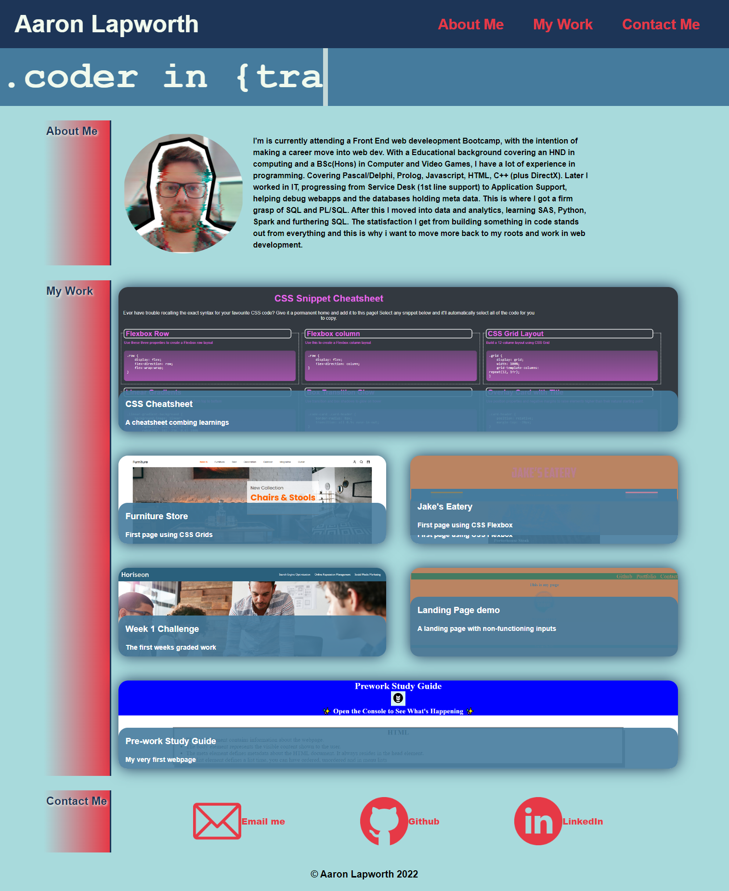

# WK2 Challenge: Personal Portfolio

## Description

 
This project is to create a personal portfolio website, do demostrate the work i have achieved so far using all the skills i have learned thus far.
Some of the acceptance criteria for this project:
* When the page is loaded the page presents your name, a recent photo or avatar, and links to sections about you, your work, and how to contact you
* When one of the links in the navigation is clicked then the UI scrolls to the corresponding section
* When viewing the section about your work then the section contains titled images of your applications
* When presented with the your first application then that application's image should be larger in size than the others
* When images of the applications are clicked then the user is taken to that deployed application
* When the page is resized or viewed on various screens and devices then the layout is responsive and adapts to my viewport

Website: https://lapworthaaron.github.io/week2_challenge/
 Repository: https://github.com/LapworthAaron/week2_challenge

Some of the elements i have accounted for:
* I have use CSS Flex boxes
* I have incorporated CSS Grids
* I have used variables in my CSS
* I have consolidated my CSS selectors
* I have used animations
* I have used links that open new tabs or default mail application
* I have designed the site to work across Mobiles, Tablets and Desktop using media queries
    * I did this using 4 seperate css files, so the css was more readable
    * I also set a reset css file
* I have made everything using accesibility standards

An assortment of Animations were a new skill i have learnt in this project.

## Table of Contents (Optional)

- [Installation](#installation)
- [Usage](#usage)
- [Credits](#credits)
- [License](#license)

## Installation

Install folder structure as is, into your root directory, then you're good to go.

## Usage

This project has no special usage instructions, it's a simple website.

## Credits

Thanks to W3Schools for their many resources.
Also thanks to my classmates for their helpful discussions during the Friday office hours.
© 2022 Aaron Lapworth. Confidential and Proprietary. All Rights Reserved.

## License

MIT License

Copyright (c) 2022 Aaron Lapworth

Permission is hereby granted, free of charge, to any person obtaining a copy
of this software and associated documentation files (the "Software"), to deal
in the Software without restriction, including without limitation the rights
to use, copy, modify, merge, publish, distribute, sublicense, and/or sell
copies of the Software, and to permit persons to whom the Software is
furnished to do so, subject to the following conditions:

The above copyright notice and this permission notice shall be included in all
copies or substantial portions of the Software.

THE SOFTWARE IS PROVIDED "AS IS", WITHOUT WARRANTY OF ANY KIND, EXPRESS OR
IMPLIED, INCLUDING BUT NOT LIMITED TO THE WARRANTIES OF MERCHANTABILITY,
FITNESS FOR A PARTICULAR PURPOSE AND NONINFRINGEMENT. IN NO EVENT SHALL THE
AUTHORS OR COPYRIGHT HOLDERS BE LIABLE FOR ANY CLAIM, DAMAGES OR OTHER
LIABILITY, WHETHER IN AN ACTION OF CONTRACT, TORT OR OTHERWISE, ARISING FROM,
OUT OF OR IN CONNECTION WITH THE SOFTWARE OR THE USE OR OTHER DEALINGS IN THE
SOFTWARE.